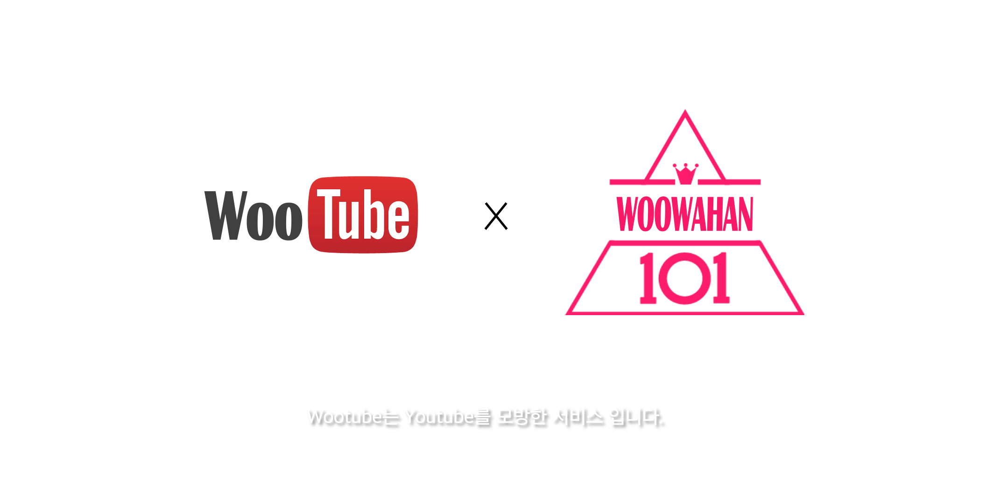
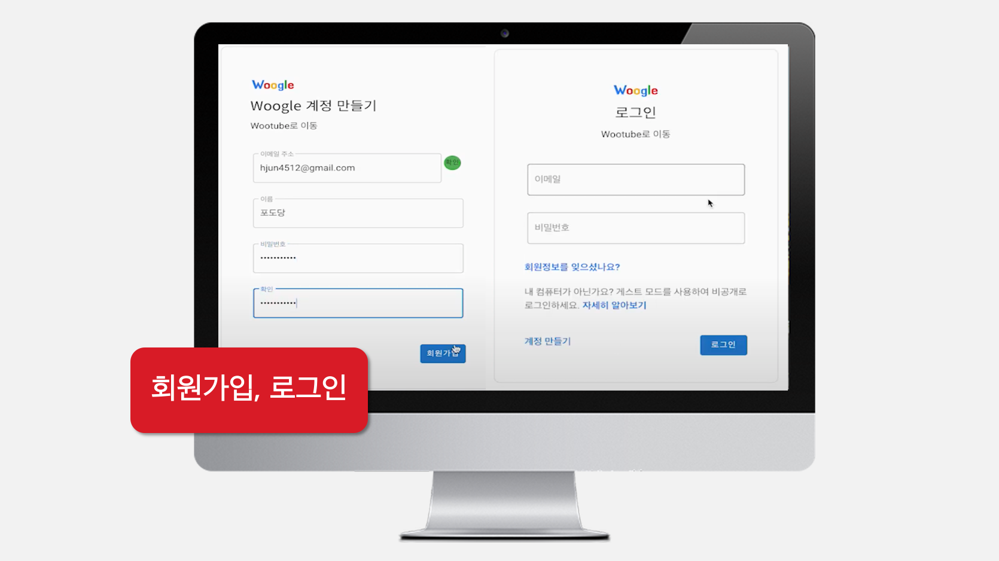
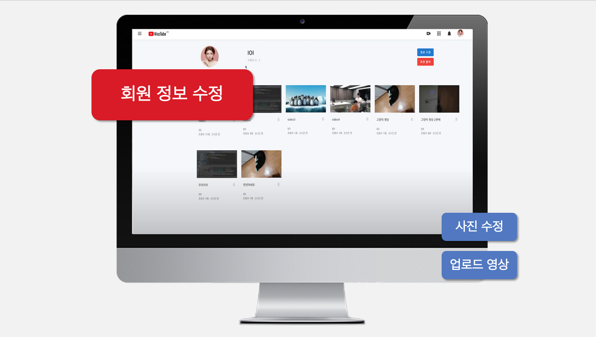
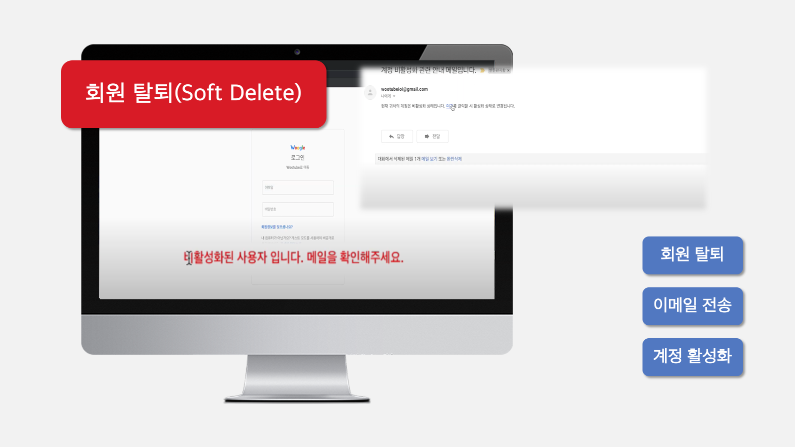
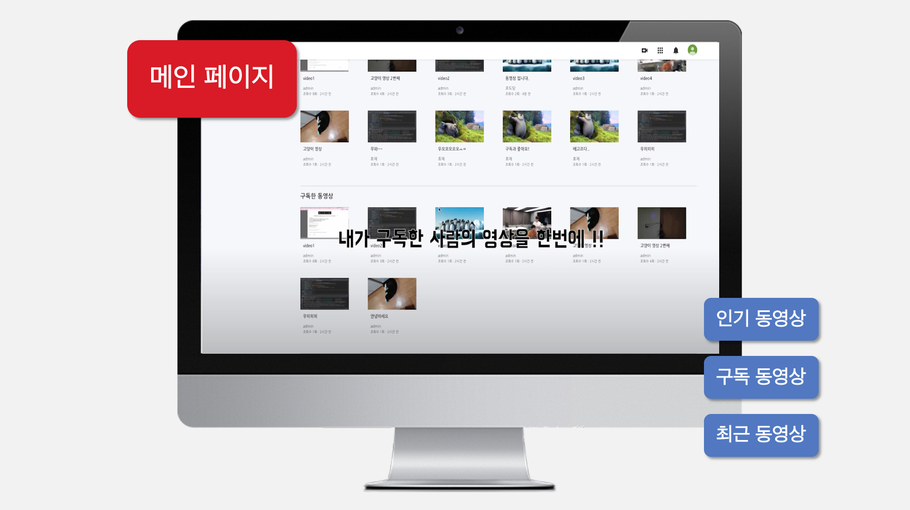
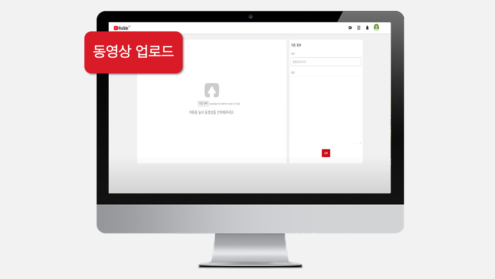
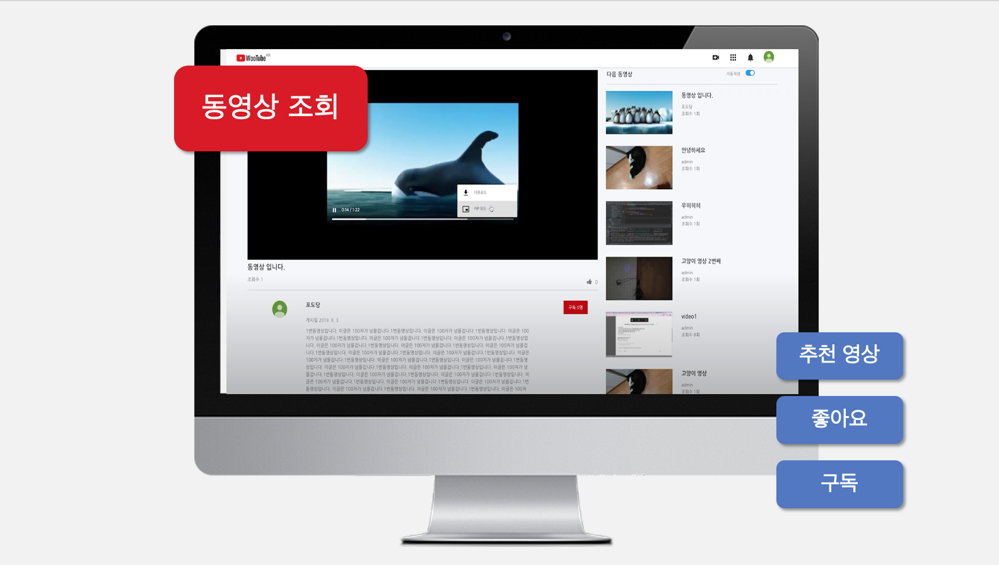
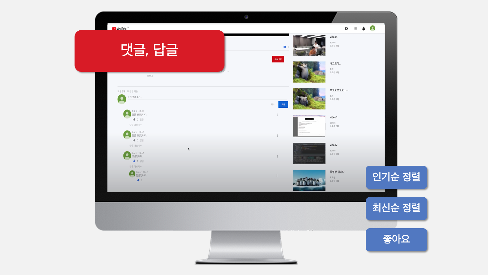

## 🙋🏻 팀원 소개(Woowahan-IOI)

|이름|닉네임|Github|
|:--:|:--:|:--:|
|권민철|루피|[TheDevLuffy](https://github.com/TheDevLuffy)|
|김효재|효오|[hyojaekim](https://github.com/hyojaekim)|
|이예지|티버|[yjll1019](https://github.com/yjll1019)|
|이인권|포도당|[backlo](https://github.com/backlo)|
|최석현|비모|[SEOKHYOENCHOI](https://github.com/SEOKHYOENCHOI)|
 

## 🔗 링크

|커밋 메시지 스타일|브랜치 전략|데모 영상|
|:--:|:--:|:--:|
|[링크](https://github.com/woowahan-ioi/miniprojects-2019/wiki/IOI-Git-%EB%B8%8C%EB%9E%9C%EC%B9%98-%EA%B4%80%EB%A6%AC-%EC%A0%84%EB%9E%B5)|[링크](https://github.com/woowahan-ioi/miniprojects-2019/wiki/IOI-Git-%EC%BB%A4%EB%B0%8B-%EB%A9%94%EC%8B%9C%EC%A7%80-%EC%8A%A4%ED%83%80%EC%9D%BC-%EA%B0%80%EC%9D%B4%EB%93%9C)|[링크](https://www.youtube.com/watch?v=aFqw6a7gvyE&ab_channel=%EC%9A%B0%EC%95%84%ED%95%9CTech)|
 

## 🖥 기능 소개

 

## 🛠 기술 스택

* Java
* HTML / CSS / JS
* Spring Boot
* Spring Data JPA
* Gradle
* Junit5
* H2
* AWS S3
 

## ✍️ 회의록 및 회고록

|회의록|회고록|
|:--:|:--:|
|[1주차](https://github.com/woowahan-ioi/miniprojects-2019/wiki/1%EC%A3%BC%EC%B0%A8-%ED%9A%8C%EC%9D%98%EB%A1%9D)|[1주차](https://github.com/woowahan-ioi/miniprojects-2019/wiki/2019.08.19-1%EC%A3%BC%EC%B0%A8-%ED%9A%8C%EA%B3%A0)|
|[2주차](https://github.com/woowahan-ioi/miniprojects-2019/wiki/2%EC%A3%BC%EC%B0%A8-%ED%9A%8C%EC%9D%98%EB%A1%9D)|[2주차](https://github.com/woowahan-ioi/miniprojects-2019/wiki/2019.08.23-2%EC%A3%BC%EC%B0%A8-%ED%9A%8C%EA%B3%A0)|
|[3주차](https://github.com/woowahan-ioi/miniprojects-2019/wiki/3%EC%A3%BC%EC%B0%A8-%ED%9A%8C%EC%9D%98%EB%A1%9D)|[3주차](https://github.com/woowahan-ioi/miniprojects-2019/wiki/2018.09.04-3%EC%A3%BC%EC%B0%A8-%ED%9A%8C%EA%B3%A0)|
 

## 🧑🏻‍💻 담당 역할 김효재(효오)

| 댓글, 답글 공통 | 댓글 |
|:--:|:--:|
| 프론트 & 백엔드 | 인기순 정렬 |
| 작성(로그인 하지 않으면 작성 불가)||
| 조회 ||
| 수정 ||
| 삭제 ||
| 최신순 정렬 ||
| 좋아요 ||
| 테스트 코드 ||
 
